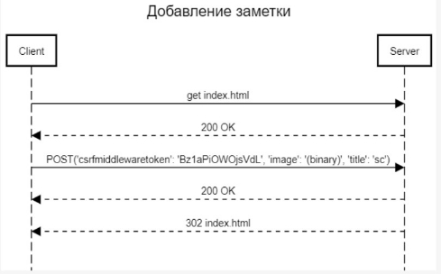

**Лабораторная работа №2** 

# **1. Цель работы:**

Разработать и реализовать клиент-серверную информационную систему, реализующую механизм CRUD.

# **2. Основное задание:**

Спроектировать и разработать систему для анонимного общения в сети интернет. 

Интерфейс системы должен представлять собой веб-страницу с лентой заметок, отсортированных в обратном хронологическом порядке и форму добавления новой заметки. В ленте отображается последние 100 заметок. 

Возможности: 

1. Добавление текстовых заметок в общую ленту; 
1. Реагирование на чужие заметки (лайки, дизлайки); 
1. Добавление комментариев к заметкам;
1. Удаление комментариев.

# **3. Создание пользовательского интерфейса:

На сайте пользователю доступны следующие возможности: 

1. Добавление текстовых заметок в общую ленту; 
1. Реагирование на чужие заметки (лайк, дизлайк);
1. Добавление комментариев;
1. Удаление комментариев;

**4.   Описание API сервера и хореографии:**

` `Пример запроса при создании новой заметки в ленте:

Пример запроса при удалении заметки:

` `Примеры запросов при оставлении реакции и комментария на заметке:

 

1. **Описание структуры базы данных:**

Для хранения данных в БД используется sqlite3. Имеются 2 таблицы: в первой таблице хранятся сами заметки, а также количество лайков и дизлайков:

Во второй таблице хранятся комментарии к заметкам. В каждой записи хранится содержание комментария и id поста, с которым он связан:

1. **Описание алгоритмов** 

 Алгоритм действий пользователя:

